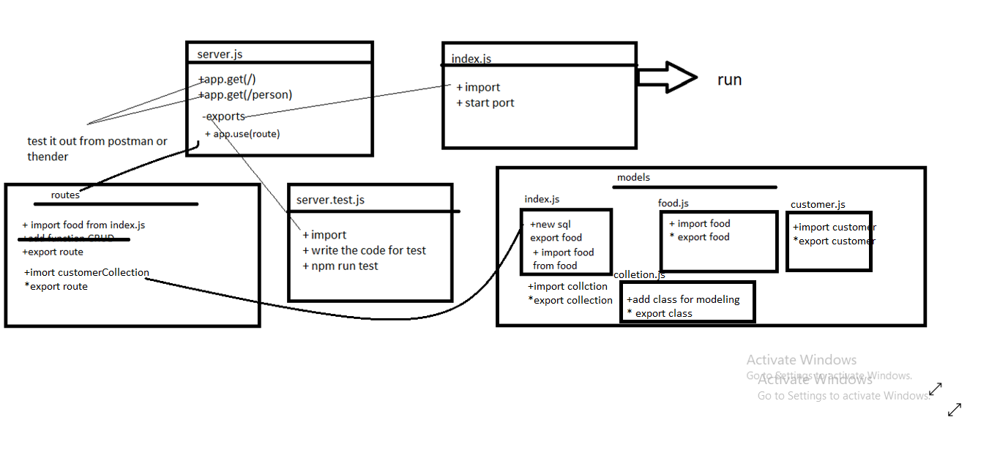

# api-server


## Author: ahmad nofal
- [tests report](https://github.com/abu-nofal/api-server/actions)
- [front-end]()
## Setup
`.env` requirements
- PORT - [8000] ||[8080]

`npm start`
- Endpoint: /customer
- Endpoint: /food
- Returns Object

```
{
  "name":"name provided"
},
{
    "nameFood":"pizza",
    "customerId":"1",
    "drink":"7up"

}
```
## Tests
- Unit Tests: npm run test
- Lint Tests: npm run lint
UML




## link for deploy 

- [for heroku](https://api-server-n.herokuapp.com/)